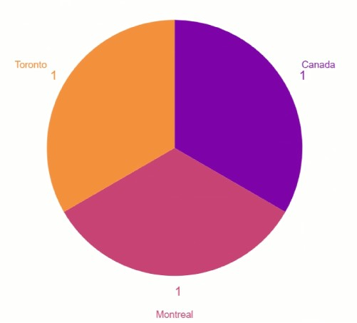
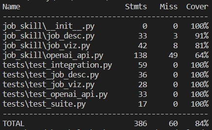

# Job-to-Skill
[![Build Status][build-shield]][build-url]
[![Release][release-shield]][release-url]
[![Forks][forks-shield]][forks-url]
[![Downloads][downloads-shield]][downloads-url]
[![Stargazers][stars-shield]][stars-url]
[![MIT License][license-shield]][license-url]

## Group members: 
- Avishek Saha: avisheksaha123@gmail.com
- Noman Mohammad: noman0786@hotmail.com
- Viji Rajagopalan: vijayalakshmi_r.here@yahoo.com


## Directory Layout:
| Section | Details|
| -----------| -----------|
|Project repository:| https://github.com/sahaavi/Job-to-Skill |
|Execution:|Run driver.ipynb, this runs the main module and has commands to view the output in dataframes and show visualizations on analytics performed|
|Package details:| Modules: run.py, job_desc.py, openai_api.py, job_viz.py|
|Documentation:| README.md, add usecase flow|
|CI/CD:| Github action is used for CI/CD and details are provided below |

### Video:
<<<upload video>>>

## Package details:
### run.py
This module accepts input from the user. This acts as the main module that calls the other .py modules for specific functions and then creates final output.
> `main` - This module accepts input from the user and validates it. User can either provide either direct job urls if they are from LinkedIn or enter job description for upto 10 jobs of interest.  
This invokes scrape_job_description method in job_desc.py if the user inputs URL to scrape job description. This invokes call_api and call_api_interview to   processes job description for desired output.
This invokes call_api_interview method in openai_api.py to call open ai API to get interview questions and answers for suggested skills.  
`call_api` - This method is used to call functions in openai_api.py to call openai API to process job description text and get analytics on skills.
 
### job_desc.py

This module is used if user selects to input job URL from LinkedIn. 
> `scrape_job_description` - This method is used to create a beautifulsoup object and scrape details of the job using the urls input by the user. It processes url by url and scrapes job description if url is valid. If url is not valid, it displays an error to the user, skips particular url and processes the others. It returns a pandas dataframe with details of job description - job location, job url, job description and job title.


### openai_api.py

This module has all functions related to the openai API calls to get job specific skill details from the job description. It then uses the skill details as input and uses openai API call again to get relevant questions for interview preparation based on the skills identified. This has two major openai API calls.
  > `call_api_skills_percent` - This method is used to call openAI api and return skills needed with Percentages. This uses two methods:
        get_skills - This method is used to extract only the skills with percentage line from api's response.
        skills_percentage - This method is used to make a dictionary of skills with percentages.
        get_all - This method is used to make a dictionary of programming languages, tools and technical skills.  
`call_api_tech_skills` - This method is used to call openAI api and return Techincal Skills.
 vii. call_api_questions - This method is used to call api and return interview questions. This used method below.
        get_questions - This method is used to call openAI api and return return relevant interview questions based off skills.  
`call_api_answers` - This method is used to call api and return suggested answers to interview questions. This used method below.
        get_question_answers - This method is used to call API and return relevant interview questions responses based off skills.  
 `call_api_interview` - This method calls functions vii and viii and returns interview question and answers in a dataframe format.
 
### job_viz.py

This module has all functions related to the visualizations built for the output based on openai APIs output. 
   > `parse_df` - This method parses the dataframe with all information and selects only columns needed for different visualizations.  
   `visualize_info` - This method is to visualize tools/languages from the jobs dataframe.
  xii. visualize_location - This method is to visualize distribution of job locations (applicable only if job links were provided in input).
 

### output files
1. jobs.csv - has details like skills and location required for each job input 
2. interview.csv - has list of interview questions for each job input with suggested answers from openai
3. visualizations in driver.ipynb


## Usage
#### `call_api_tech_skills`   
Returns the tech skills, required programming languages and tools needed based on job description. 

```python
import openai_api as oa
api_key = 'x'
job_description = 'Work on challenging and research-based initiatives using advanced machine learning......'
skills = oa.call_api_tech_skills(api_key, job_description)
```

#### `call_api_questions`
Returns interview questions based on technical skills.

```python
questions = oa.call_api_questions(api_key, skills)
```

#### `call_api_answers`
Returns answers of those interview questions.
```python
answers = oa.call_api_answers(api_key, skills)
```
#### `run`
If you run this file it will take all the user input from user and generate 2 csv file which will contain job title, url, location, tech skills, programming languages and tools required for that job, interview questions and sample answers.
```python
from job_skill import run
run.main()
```
This will generate 2 csv files named `interview.csv` and `jobs.csv`.

#### `visualize_info`
```python
from job_skill import job_viz as jv

jobs_df = pd.read_csv("jobs.csv")

lang = jv.parse_df(jobs_df, 'Programming Languages')
tools = jv.parse_df(jobs_df, 'Tools')

jv.visualize_info(lang, tools)
```
Output:  


#### `visualize_location`
```python
jv.visualize_location(jobs_df, 'Job Location')
```
Output:  


## Report Coverage:


<!-- MARKDOWN LINKS & IMAGES -->
[build-shield]: https://github.com/sahaavi/Job-to-Skill/actions/workflows/build.yml/badge.svg
[release-shield]: https://img.shields.io/github/v/release/sahaavi/Job-to-Skill.svg?style=flat-square
[release-url]: https://github.com/sahaavi/Job-to-Skill/releases
[forks-shield]: https://img.shields.io/github/forks/sahaavi/Job-to-Skill.svg?style=flat-square
[forks-url]: https://github.com/sahaavi/Job-to-Skill/network/members
[downloads-shield]: https://img.shields.io/github/downloads/sahaavi/Job-to-Skill/total.svg?style=flat-square
[downloads-url]: https://github.com/sahaavi/Job-to-Skill
[stars-shield]: https://img.shields.io/github/stars/sahaavi/Job-to-Skill.svg?style=flat-square
[stars-url]: https://github.com/sahaavi/Job-to-Skill/stargazers
[license-shield]: https://img.shields.io/github/license/sahaavi/Job-to-Skill.svg?style=flat-square
[license-url]: https://github.com/sahaavi/Job-to-Skill/blob/master/LICENSE
[build-url]: https://github.com/sahaavi/Job-to-Skill/actions/workflows/build.yml
